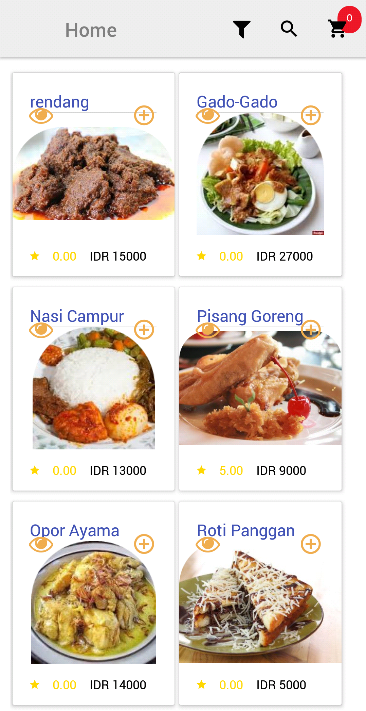
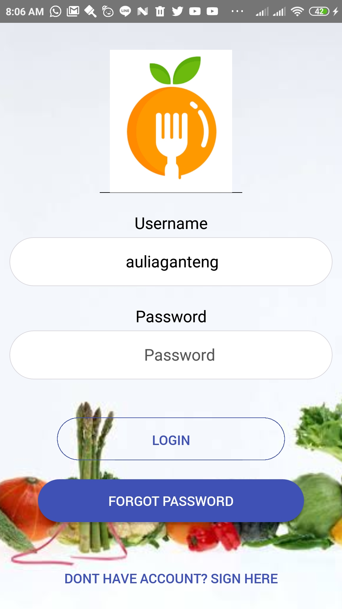

# myAngkringan Mobile

<h1 align="center">MyAngkringan - Simple restaurant app</h1>

MyAngkringan Mobile is a simple restaurant application specially for Mobile Android and IOS. Built with NodeJs using the ReactJs and React Native Framework.
React Native is a library framework for Javascript to create mobile app using javascript.

## Requirements
1. <a href="https://nodejs.org/en/download/">Node Js</a>
2. <a href="https://github.com/facebook/react">React</a>
2. <a href="https://facebook.github.io/react-native/">React Native</a>
3. <a href="https://www.npmjs.com/">Npm</a>
3. <a href="https://yarnpkg.com/">Yarn</a>

## How to run the app ?
1. Type `yarn install` [here](#requirements)
2. if you want to use your own server turn on backend from this repo [here](https://github.com/auliaramadhan/myAngkringan)
2. change all address in axios to your host address or localhost using replace in VSCodes
3. run `npx react-native run-android`
4. To build apk Project use `cd android && ./gradlew assembleRelease `

This project was bootstrapped with [Create React App](https://github.com/facebook/create-react-app).

# Screenschot

  
  
  
  

